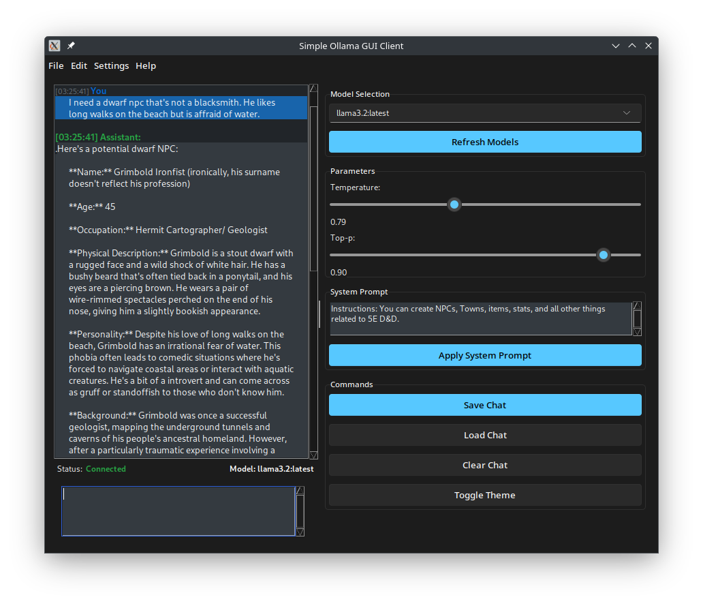

# Simple Ollama GUI Client

A simple, user-friendly graphical interface for interacting with Ollama AI models locally. This project is working nicely but could use a bit more polish in some areas.

This project demonstrates the potential of human-AI collaboration in software development, combining human direction and oversight with AI-assisted coding and implementation.



## Features

- **Modern UI**: Clean interface with light and dark themes using Windows 11-style design
- **Model Selection**: Easily switch between any models installed in your Ollama instance
- **Parameter Control**: Adjust temperature, top_p and other model parameters
- **System Prompts**: Configure and save system prompts for different use cases
- **Chat History**: Save, load and manage your conversation history
- **Real-time Streaming**: See model responses as they're generated

## Requirements

- Python 3.8 or higher
- Ollama running locally or on a remote server
- [Ollama models](https://ollama.com/library) installed

## Installation

1. Clone the repository:
   ```bash
   git clone https://github.com/yourusername/simple-ollama-gui-client.git
   cd simple-ollama-gui-client
   ```

2. Create and activate a virtual environment:
   ```bash
   # Windows
   python -m venv .venv
   .venv\Scripts\activate

   # macOS/Linux
   python3 -m venv .venv
   source .venv/bin/activate
   ```

3. Run the setup script:
   ```bash
   python setup.py
   ```

## Usage

1. Make sure Ollama is running (default: http://localhost:11434)
2. Start the application:
   ```bash
   python run.py
   ```

3. Select a model from the dropdown menu
4. Adjust parameters as needed
5. Type your message and press Enter or click Send

## Configuration

The application stores configuration in `config.ini` which includes:

- API URL for Ollama
- Last used model
- Parameter settings
- System prompt

## Advanced Configuration

### Connection Settings

You can connect to a remote Ollama instance by changing the API URL in the Settings menu.

### Custom Models

The application will automatically detect all models installed in your Ollama instance.

## Development

### Project Structure 